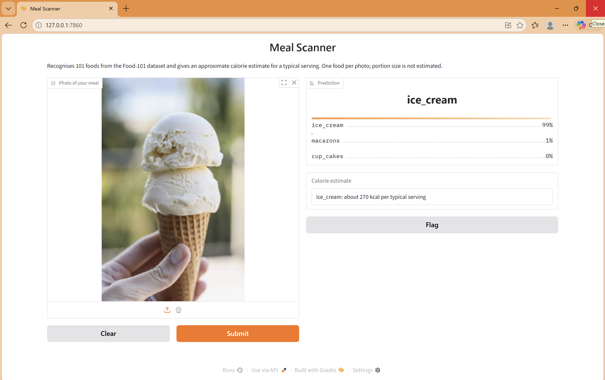
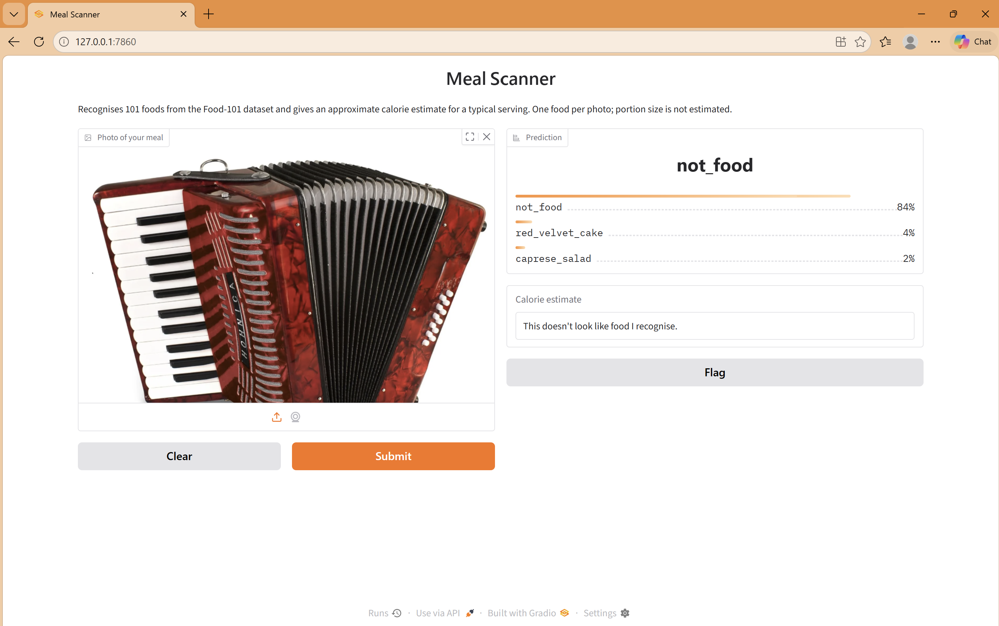

# Calorie Tracker

Identifies one of 101 foods from a photo and estimates calories for a typical serving.
Built by fine-tuning EfficientNet-B0 on Food-101, with a "not food" class to reject non-food images.

## Demo




## Results

| Model | Test accuracy |
|---|---|
| Frozen backbone (final layer only) | 58.9% |
| Fine-tuned (last 3 blocks unfrozen) | 78% |

Evaluated on the Food-101 test split (250 images per food) plus 250 non-food images, 102 classes in total.

**Confidence threshold** 
| Class                     | Precision | Recall | F1 Score | Size    |
|---------------------------|-----------|--------|----------|---------|
| lasagna                   | 0.74      | 0.71   | 0.72     | 250     |
| lobster_bisque            | 0.87      | 0.80   | 0.83     | 250     |
| lobster_roll_sandwich     | 0.88      | 0.90   | 0.89     | 250     |
| macaroni_and_cheese       | 0.82      | 0.76   | 0.79     | 250     |
| macarons                  | 0.94      | 0.96   | 0.95     | 250     |
| miso_soup                 | 0.91      | 0.90   | 0.91     | 250     |
| mussels                   | 0.94      | 0.86   | 0.90     | 250     |
| nachos                    | 0.69      | 0.81   | 0.74     | 250     |
| omelette                  | 0.71      | 0.65   | 0.68     | 250     |
| onion_rings               | 0.89      | 0.88   | 0.89     | 250     |
| oysters                   | 0.91      | 0.92   | 0.91     | 250     |
| pad_thai                  | 0.90      | 0.88   | 0.89     | 250     |
| paella                    | 0.86      | 0.78   | 0.82     | 250     |
| pancakes                  | 0.85      | 0.82   | 0.83     | 250     |
| panna_cotta               | 0.81      | 0.70   | 0.75     | 250     |
| peking_duck               | 0.88      | 0.75   | 0.81     | 250     |
| pho                       | 0.87      | 0.93   | 0.90     | 250     |
| pizza                     | 0.81      | 0.89   | 0.85     | 250     |
| pork_chop                 | 0.61      | 0.50   | 0.55     | 250     |
| poutine                   | 0.88      | 0.84   | 0.86     | 250     |
| prime_rib                 | 0.77      | 0.84   | 0.80     | 250     |
| pulled_pork_sandwich      | 0.83      | 0.67   | 0.74     | 250     |
| ramen                     | 0.92      | 0.81   | 0.86     | 250     |
| ravioli                   | 0.63      | 0.62   | 0.62     | 250     |
| red_velvet_cake           | 0.84      | 0.88   | 0.86     | 250     |
| risotto                   | 0.71      | 0.67   | 0.69     | 250     |
| samosa                    | 0.82      | 0.78   | 0.80     | 250     |
| sashimi                   | 0.87      | 0.92   | 0.89     | 250     |
| scallops                  | 0.70      | 0.61   | 0.65     | 250     |
| seaweed_salad             | 0.90      | 0.90   | 0.90     | 250     |
| shrimp_and_grits          | 0.69      | 0.68   | 0.69     | 250     |
| spaghetti_bolognese       | 0.90      | 0.88   | 0.89     | 250     |
| spaghetti_carbonara       | 0.90      | 0.94   | 0.92     | 250     |
| spring_rolls              | 0.83      | 0.78   | 0.81     | 250     |
| steak                     | 0.48      | 0.50   | 0.49     | 250     |
| strawberry_shortcake      | 0.73      | 0.82   | 0.77     | 250     |
| sushi                     | 0.84      | 0.83   | 0.83     | 250     |
| tacos                     | 0.67      | 0.73   | 0.70     | 250     |
| takoyaki                  | 0.87      | 0.86   | 0.87     | 250     |
| tiramisu                  | 0.75      | 0.76   | 0.75     | 250     |
| tuna_tartare              | 0.67      | 0.63   | 0.65     | 250     |
| waffles                   | 0.83      | 0.88   | 0.85     | 250     |
| not_food                  | 0.98      | 0.96   | 0.97     | 250     |


**Most common confusions:** 
steak predicted as filet_mignon: 41 times
filet_mignon predicted as steak: 36 times
beef_tartare predicted as tuna_tartare: 28 times
pulled_pork_sandwich predicted as hamburger: 27 times
pork_chop predicted as steak: 27 times
cheesecake predicted as strawberry_shortcake: 24 times
steak predicted as prime_rib: 22 times
ravioli predicted as gnocchi: 21 times
pork_chop predicted as filet_mignon: 21 times
tuna_tartare predicted as beef_tartare: 20 times


## How it works

- Transfer learning: pretrained EfficientNet-B0 (ImageNet) with the final layer replaced by 102 outputs
- Stage 1: only the new layer is trained
- Stage 2: the last 3 blocks are unfrozen and trained at a lower learning rate (1e-4)
- Non-food class built from 750 Caltech101 images, with food-like categories excluded
- The app returns one of three responses: a confident answer, a best guess with alternatives, or "not sure"
- Calories come from a lookup table of approximate values per typical serving

## Run it locally
```
pip install -r requirements.txt
python app.py
```

Open the local link Gradio prints. `food_model.pth`, `classes.json` and `calories.json` must be in the same folder as `app.py`.

## Limitations

- One food per photo. Multi-item plates are not handled.
- Portion size is not estimated, so calories are per typical serving only.
- Calorie values are my own approximate estimates, not looked-up USDA values.
- Only the 101 Food-101 foods, which skew towards Western and restaurant dishes.
- Non-food images came from Caltech101, which look different from phone photos, so some non-food will still be misclassified.
- The best epoch and threshold were chosen using the test set, so the reported accuracy is slightly optimistic.

## Future work

- Portion estimation (e.g. using the Nutrition5k dataset)
- Multi-food plates via detection or segmentation
- Export to ONNX for free in-browser hosting
- Stronger data augmentation for real phone photos

## Data and credits

- [Food-101](https://data.vision.ee.ethz.ch/cvl/datasets_extra/food-101/) and [Caltech101](https://data.caltech.edu/records/mzrjq-6wc02) were used for training. The data is not included in this repo.
- Pretrained EfficientNet-B0 weights come from torchvision (trained on ImageNet).
- Check each dataset's own terms before reuse.
